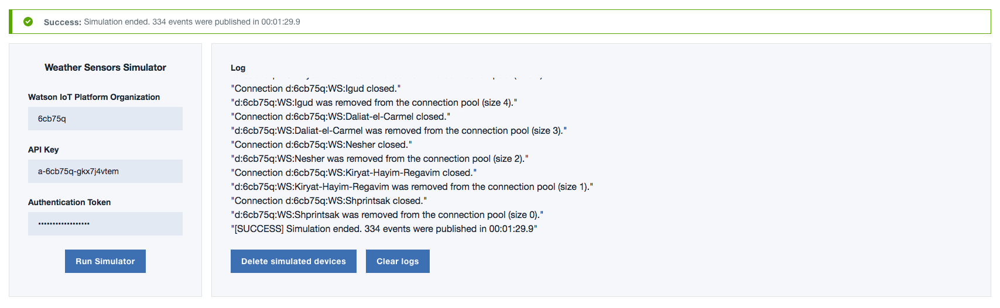
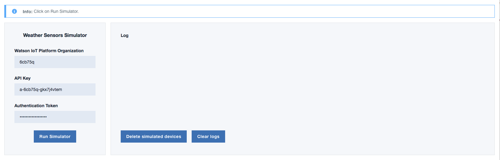
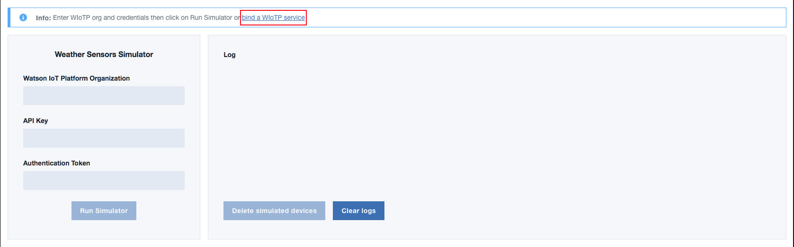
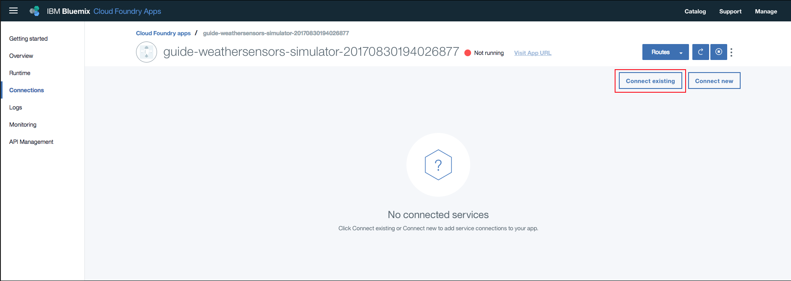
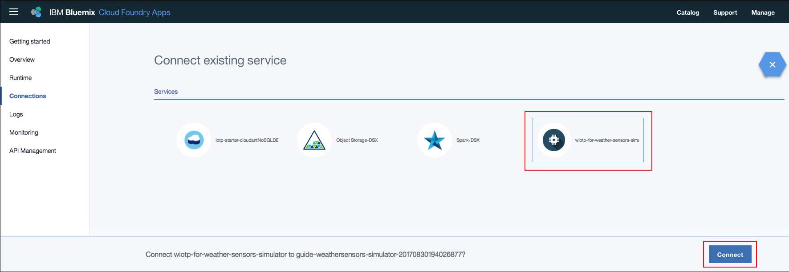
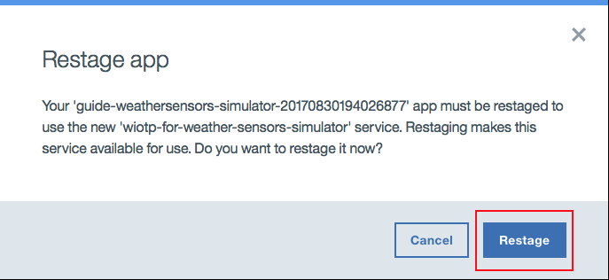
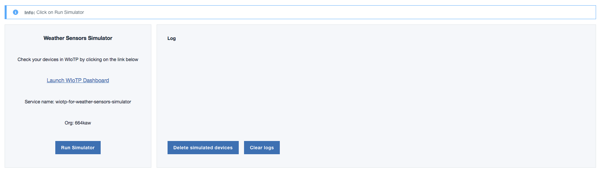
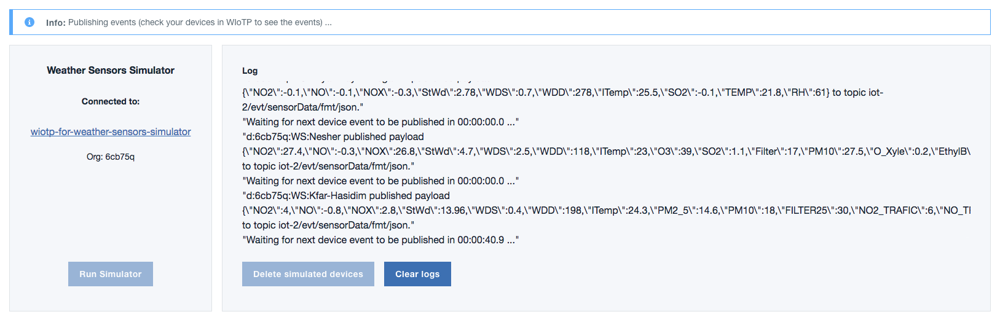
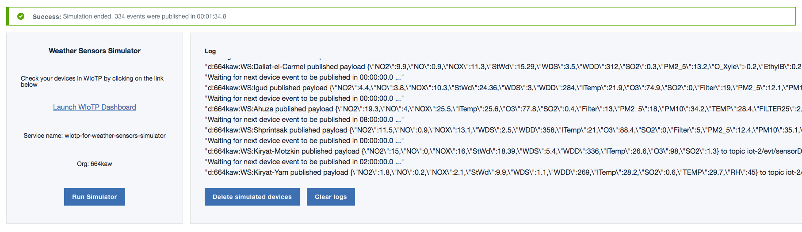

## Watson IoT Platform getting started guides

This sample application is included as a component in a set of guides that step through the basics of integrating IBM Watson IoT Platform with IBM Watson Analytics and IBM Data Science Experience. For more information about the guides, see the [Watson IoT Platform documentation](https://console.bluemix.net/docs/services/IoT/getting_started/getting-started-iot-overview.html).

# Weather sensors simulator

A web app that simulates 17 weather stations in the Haifa district (Israel) and send their data to IBM Watson IoT Platform.

## Run your own copy of the web application

[Option A: Deploy the simulator and use an existing instance of WIoTP](#deploy-a-standalone-version-of-the-simulator-through-bluemix-devops-and-use-an-existing-instance-of-ibm-watson-iot-platform)

[Option B: Deploy the simulator along with a new instance of WIoTP](#deploy-through-bluemix-devops-along-with-a-new-instance-of-ibm-watson-iot-platform)

### Deploy a standalone version of the simulator through Bluemix devOps and use an existing instance of IBM Watson IoT Platform

1. Click on the button below and follow the instructions in Bluemix to deploy and view your web app.

  

2. Click View app to launch your web app once the pipeline has deployed the app. (The deployment takes a few minutes. You can check the status by clicking the Delivery pipeline tile.) 

After you have deployed the app, bind your existing Watson IoT platform service to the app using one of the following two options:

[Option 1: Generate access credentials in WIoTP and input them in the simulator (steps 3 to 5)](#generate-access-credentials-in-wiotp-and-input-them-in-the-simulator)

[Option 2: Bind the simulator with WIoTP using Bluemix connections (steps 6 to 11)](#bind-the-simulator-with-wiotp-using-bluemix-connections)

#### Generate access credentials in WIoTP and input them in the simulator
In the device simulator app, you need to provide your WIoTP Organization ID, API Key and Authentication Token for it to access your WIoTP service to delete/create devices and device types, and also to publish device events.  

3. Your WIoTP Organization ID can be found underneath your user name on the top right corner of WIoTP menu bar as shown below.

4. To obtain your WIoTP credentials, click on Apps option in the IoT platform left navigator and generate API key and authentication token. Don't forget to write down the authentication token as it will not be available after you finish the process of creating your API key.  

5. Back to the simulator web app, fill in the fields (organization, API Key and authentication token).

#### Bind the simulator with WIoTP using Bluemix connections

Alternatively to creating API Key and token, you can follow the steps below to bind your existing WIoTP service with the simulator. If you perfomed steps 3 to 5, skip to step 12.

6. Click on the link to start the process of binding WIoTP to the simulator, as shown below.

7. In Bluemix, click on `Connect existing`.

8. Select the WIoTP service you want to bind and click on `Connect`.

9. Click on `Restage` to restart the simulator.

10. Wait for the simulator to restart and then click on `Visit App URL`

11. You will be redirected back to the simulator page. Because the simulator is now bound to the WIoTP service, you will no longer need to input access credentials. Also, you can visit your WIoTP devices page directly from the link in the simulator.

12. Click on Run Simulator. The simulation log will be displayed on the panel to the right. At any time during the simulation you can click on the `Launch WIoTP Dashboard` link so that you can see the devices and device types that the simulator app has registered.

13. The information box at the top will display the current status of simulation. When the simulation is done, you should see a success message.  

14. If you want to delete the devices and device types created by the simulator from the WIoTP service, just click on Delete simulated devices.

### Deploy through Bluemix devOps along with a new instance of IBM Watson IoT Platform

1. Click on the button below and follow the instructions in Bluemix to deploy and view your web app.

  

2. Click View app to launch your web app once the pipeline has deployed the app. (The deployment takes a few minutes. You can check the status by clicking the Delivery pipeline tile.) 

3. A new instance of the Watson IoT Platform service will be created in your Bluemix account. This service will be bound to the Weather Sensors Simulator app. All you need to do is click on Run Simulator.

4. The simulation log will be displayed on the panel to the right. At any time during the simulation you can click on the link to your Watson IoT Platform service so that you can see the devices and device types that the simulator app has registered.

5. If you want to delete the devices and device types created by the simulator from your WIoTP service, just click on Delete simulated devices.

### Troubleshooting

If you notice any problems in the simulator, try restarting the web app in [Bluemix Apps dashboard](https://console.bluemix.net/dashboard/apps). Once it restarts, refresh the page and try running the simulator again.

# Privacy notice

This web application includes code to track deployments to [IBM Bluemix](https://www.bluemix.net/) and other Cloud Foundry platforms. The following information is sent to a [Deployment Tracker](https://github.com/cloudant-labs/deployment-tracker) service on each deployment:

* Application Name (`application_name`)
* Space ID (`space_id`)
* Application Version (`application_version`)
* Application URIs (`application_uris`)

This data is collected from the `VCAP_APPLICATION` environment variable in IBM Bluemix and other Cloud Foundry platforms. This data is used by IBM to track metrics around deployments of sample applications to IBM Bluemix to measure the usefulness of our examples, so that we can continuously improve the content we offer to you. Only deployments of sample applications that include code to ping the Deployment Tracker service will be tracked.

## Disabling deployment tracking

Deployment tracking can be disabled by removing the `require('cf-deployment-tracker-client').track();` line from the './app.js' file.

## Useful links
[Install Node.js]: https://nodejs.org/en/download/
[bluemix_dashboard_url]: https://console.ng.bluemix.net/dashboard/
[bluemix_signup_url]: https://console.ng.bluemix.net/registration/
[cloud_foundry_url]: https://github.com/cloudfoundry/cli

[IBM Bluemix](https://bluemix.net/)  
[IBM Bluemix Documentation](https://www.ng.bluemix.net/docs/)  
[IBM Bluemix Developers Community](http://developer.ibm.com/bluemix)  
[IBM Watson Internet of Things](http://www.ibm.com/internet-of-things/)  
[IBM Watson IoT Platform](http://www.ibm.com/internet-of-things/iot-solutions/watson-iot-platform/)   
[IBM Watson IoT Platform Developers Community](https://developer.ibm.com/iotplatform/)
