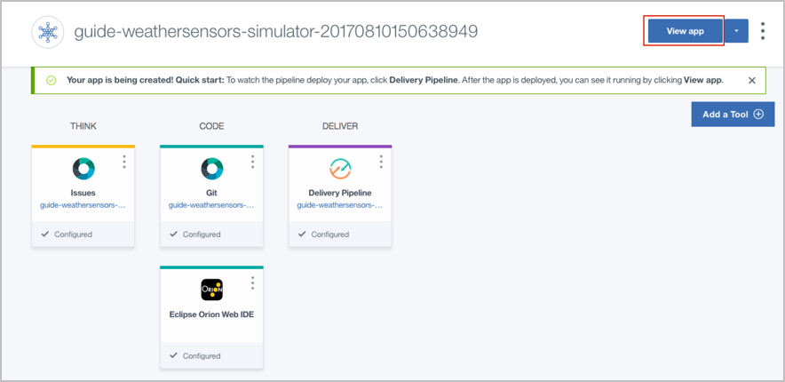
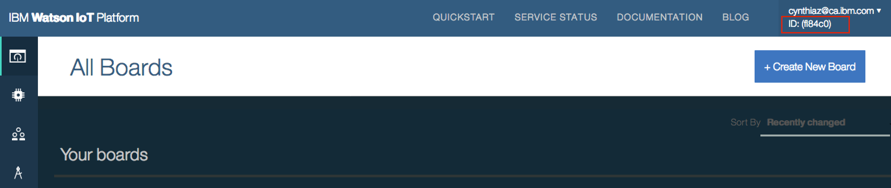
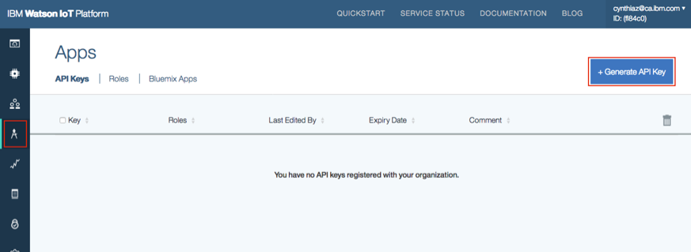
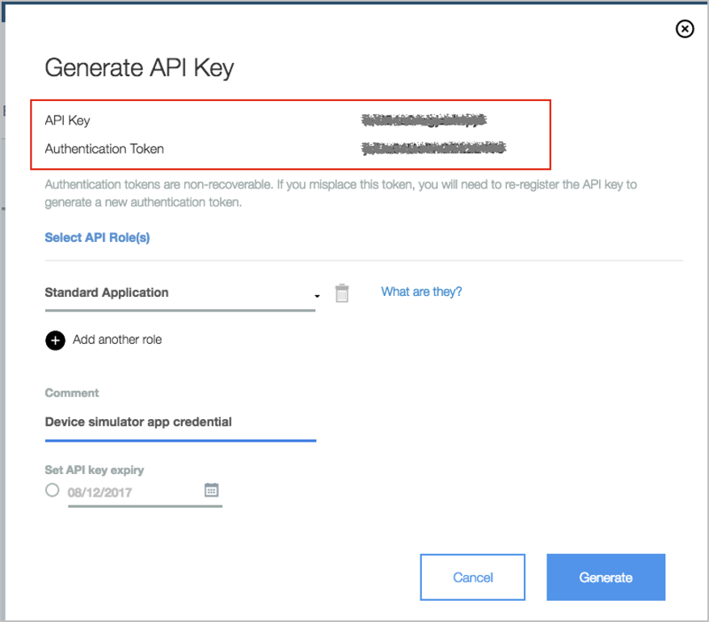
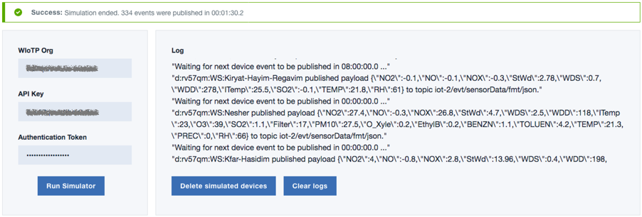

## Watson IoT Platform getting started guides

This sample application is included as a component in a set of guides that step through the basics of integrating IBM Watson IoT Platform with IBM Watson Analytics and IBM Data Science Experience. For more information about the guides, see the [Watson IoT Platform documentation](https://console.bluemix.net/docs/services/IoT/getting_started/getting-started-iot-overview.html).

# Weather sensors simulator

A web app that simulates several weather sensors in the Haifa region that send data to IBM Watson IoT Platform.

## Run your own copy of the web application

### Deploy through Bluemix devOps

1. Click on the button below and follow the instructions in Bluemix to deploy and view your web app.

2. Click View app to launch your web app once the pipeline has deployed the app. (The deployment takes a few minutes. You can check the status by clicking the Delivery pipeline tile.) 

3. In the device simulator app, you need to provide your IoTP Org ID, API Key and Authentication Token for it to access your IoTP service to delete/create devices and device types, and also to publish device events. Your WIoTP Org ID can be found underneath your user name on the top right corner of WIoTP menu bar as shown below.

To obtain your IoTP credential, click on Apps option in the IoT platform left navigator and generate API key and authentication token. Don't forget to write down the authentication token as it will not be available after you finish the process of creating your API key.  

Back to the simulator web app, fill in the fields (org, API Key and authentication token), then click on Run Simulator.

4. The information box at the top will display the current status of simulation. When the simulation is done, you should see a success message.

If you want to delete the devices and device types created by the simulator from your WIoTP service, just click on Delete simulated devices.

### Troubleshooting

If you notice any problems in the simulator, try restarting the web app in [Bluemix Apps dashboard](https://console.bluemix.net/dashboard/apps). Once it restarts, refresh the page and try running the simulator again.

# Privacy notice

This web application includes code to track deployments to [IBM Bluemix](https://www.bluemix.net/) and other Cloud Foundry platforms. The following information is sent to a [Deployment Tracker](https://github.com/cloudant-labs/deployment-tracker) service on each deployment:

* Application Name (`application_name`)
* Space ID (`space_id`)
* Application Version (`application_version`)
* Application URIs (`application_uris`)

This data is collected from the `VCAP_APPLICATION` environment variable in IBM Bluemix and other Cloud Foundry platforms. This data is used by IBM to track metrics around deployments of sample applications to IBM Bluemix to measure the usefulness of our examples, so that we can continuously improve the content we offer to you. Only deployments of sample applications that include code to ping the Deployment Tracker service will be tracked.

## Disabling deployment tracking

Deployment tracking can be disabled by removing the `require('cf-deployment-tracker-client').track();` line from the './app.js' file.

## Useful links
[Install Node.js]: https://nodejs.org/en/download/
[bluemix_dashboard_url]: https://console.ng.bluemix.net/dashboard/
[bluemix_signup_url]: https://console.ng.bluemix.net/registration/
[cloud_foundry_url]: https://github.com/cloudfoundry/cli

[IBM Bluemix](https://bluemix.net/)  
[IBM Bluemix Documentation](https://www.ng.bluemix.net/docs/)  
[IBM Bluemix Developers Community](http://developer.ibm.com/bluemix)  
[IBM Watson Internet of Things](http://www.ibm.com/internet-of-things/)  
[IBM Watson IoT Platform](http://www.ibm.com/internet-of-things/iot-solutions/watson-iot-platform/)   
[IBM Watson IoT Platform Developers Community](https://developer.ibm.com/iotplatform/)
